# C4 Component Diagram - Building Blocks Architecture

```mermaid
C4Component
    title Component Architecture - Building Blocks Pattern

    Container_Boundary(pipeline, "Pipeline Orchestrator") {
        Component(orchestrator, "ExperimentOrchestrator", "Python Class", "Main coordinator for 6-phase pipeline")
        Component(config, "ExperimentConfig", "Dataclass", "Configuration parameters")
        Component(parallel_exec, "ParallelExecutor", "Python Class", "Multiprocessing pool manager")
    }

    Container_Boundary(blocks, "Building Blocks Module - 6 Contracts") {
        Component(bb1, "JSONDataLoader", "Building Block #1", "Contract: load(path) → Dataset")
        Component(bb2, "TechniquePromptBuilder", "Building Block #2", "Contract: build(technique) → Prompt")
        Component(bb3, "UnifiedLLMInterface", "Building Block #3", "Contract: execute(prompt) → Response")
        Component(bb4, "MetricCalculator", "Building Block #4", "Contract: calculate(response) → Metrics")
        Component(bb5, "ResultAggregator", "Building Block #5", "Contract: aggregate(results) → Summary")
        Component(bb6, "MatplotlibVisualizer", "Building Block #6", "Contract: visualize(data) → Figure")
    }

    Container_Boundary(data, "Data Module") {
        Component(dataset_creator, "DatasetCreator", "Python Class", "Creates 140 samples (2 datasets)")
        Component(validators, "DatasetValidator", "Python Class", "Validates PRD compliance")
        Component(loaders, "load_dataset", "Function", "JSON parsing and loading")
    }

    Container_Boundary(llm_mod, "LLM Module") {
        Component(llm_client, "LLMClient", "Python Class", "Multi-provider abstraction")
        Component(llm_openai, "OpenAI Handler", "Component", "GPT-4, GPT-3.5-turbo")
        Component(llm_anthropic, "Anthropic Handler", "Component", "Claude Opus/Sonnet/Haiku")
        Component(llm_ollama, "Ollama Handler", "Component", "Local LLMs + auto-download")
    }

    Container_Boundary(prompts_mod, "Prompts Module") {
        Component(base_prompt, "PromptTechnique", "Base Class", "Abstract template pattern")
        Component(baseline, "BaselinePrompt", "Technique #1", "Direct question answering")
        Component(cot, "ChainOfThoughtPrompt", "Technique #2", "Step-by-step reasoning")
        Component(react, "ReActPrompt", "Technique #3", "Reason + Act pattern")
        Component(tot, "TreeOfThoughtsPrompt", "Technique #4", "Multiple reasoning paths")
    }

    Container_Boundary(metrics_mod, "Metrics Module") {
        Component(accuracy, "AccuracyCalculator", "Component", "Exact + fuzzy matching")
        Component(info_theory, "InformationTheory", "Component", "Entropy, Perplexity, Loss")
        Component(aggregator, "MetricAggregator", "Component", "Cross-dataset aggregation")
    }

    Container_Boundary(viz_mod, "Visualization Module") {
        Component(plotters, "Plotters", "12 Functions", "plot_accuracy, plot_loss, plot_heatmap, etc.")
        Component(viz_gen, "VisualizationGenerator", "Component", "Orchestrates 4 key visualizations")
        Component(report_gen, "ReportGenerator", "Component", "Markdown/HTML reports")
    }

    Rel(orchestrator, config, "Uses")
    Rel(orchestrator, parallel_exec, "Delegates to")

    Rel(orchestrator, bb1, "Phase 1: Load")
    Rel(orchestrator, bb2, "Phase 2-3: Build prompts")
    Rel(orchestrator, bb3, "Phase 2-3: Execute")
    Rel(orchestrator, bb4, "Phase 4: Calculate")
    Rel(orchestrator, bb5, "Phase 5: Aggregate")
    Rel(orchestrator, bb6, "Phase 6: Visualize")

    Rel(bb1, loaders, "Implements contract via")
    Rel(bb2, base_prompt, "Implements contract via")
    Rel(bb3, llm_client, "Implements contract via")
    Rel(bb4, info_theory, "Implements contract via")
    Rel(bb5, aggregator, "Implements contract via")
    Rel(bb6, plotters, "Implements contract via")

    Rel(llm_client, llm_openai, "Delegates to")
    Rel(llm_client, llm_anthropic, "Delegates to")
    Rel(llm_client, llm_ollama, "Delegates to")

    Rel(base_prompt, baseline, "Extended by")
    Rel(base_prompt, cot, "Extended by")
    Rel(base_prompt, react, "Extended by")
    Rel(base_prompt, tot, "Extended by")

    Rel(info_theory, accuracy, "Uses")
```

**Key Components:**

**Building Blocks (6 Contracts)**:
1. **JSONDataLoader**: Standardized dataset loading interface
2. **TechniquePromptBuilder**: Strategy pattern for 7 prompt techniques
3. **UnifiedLLMInterface**: Adapter pattern for multi-provider LLM access
4. **MetricCalculator**: Information-theoretic metric computation
5. **ResultAggregator**: Cross-dataset result aggregation
6. **MatplotlibVisualizer**: Publication-ready chart generation

**Pipeline Orchestrator**:
- **ExperimentOrchestrator**: Main coordinator (94 executable statements after refactor)
- **ExperimentConfig**: Immutable configuration with validation
- **ParallelExecutor**: multiprocessing.Pool with 95% test coverage

**Data Module**:
- **DatasetCreator**: Generates 70 Simple QA + 70 Multi-step Reasoning samples
- **DatasetValidator**: Validates required fields, categories, step counts
- **load_dataset()**: JSON parsing with error handling

**LLM Module** (Adapter Pattern):
- **LLMClient**: Unified interface with temperature, max_tokens, fast_mode
- **OpenAI Handler**: GPT-4, GPT-3.5-turbo with logprobs
- **Anthropic Handler**: Claude models (no logprobs, uses fallback metrics)
- **Ollama Handler**: Local LLMs with auto-download via `_ensure_ollama_model_exists()`

**Prompts Module** (Strategy Pattern):
- **PromptTechnique**: Abstract base with `build()` method
- **7 Techniques**: Baseline, CoT, CoT++, ReAct, ToT, Role-Based, Few-Shot
- **Fast Mode Support**: Shortened prompts for local LLMs

**Metrics Module**:
- **AccuracyCalculator**: Exact match + fuzzy matching with alternatives
- **InformationTheory**: Entropy (bits), Perplexity, Composite Loss
- **Fallback Metrics**: Length-based estimates when logprobs unavailable

**Visualization Module**:
- **Plotters**: 12 chart types (bars, boxes, violins, heatmaps, etc.)
- **VisualizationGenerator**: Creates 4 key plots per experiment
- **ReportGenerator**: Markdown/HTML with embedded charts

**Design Patterns Used**:
- **Strategy Pattern**: Interchangeable prompt techniques
- **Adapter Pattern**: Multi-provider LLM abstraction
- **Template Pattern**: Base prompt class with `build()` hook
- **Builder Pattern**: ExperimentConfig with fluent interface
- **Contract Pattern**: Building blocks with defined interfaces
