# C4 Container Diagram - Prompt Optimization System

```mermaid
C4Container
    title Container Architecture - 8 Main Modules

    Person(user, "Researcher", "Runs experiments via CLI")

    Container_Boundary(app, "Prompt Optimization Application") {
        Container(cli, "CLI Module", "Python/Click", "Command-line interface for experiment management")

        Container(pipeline, "Pipeline Orchestrator", "Python", "Coordinates 6-phase experimental workflow")

        Container(data, "Data Module", "Python", "Dataset creation, loading, and validation (140 samples)")

        Container(llm, "LLM Client", "Python", "Multi-provider API abstraction (OpenAI, Anthropic, Ollama)")

        Container(prompts, "Prompts Module", "Python", "7 prompt technique implementations (CoT, ReAct, ToT, etc.)")

        Container(metrics, "Metrics Module", "Python", "Information-theoretic calculations (Entropy, Perplexity, Loss)")

        Container(viz, "Visualization Module", "Python/Matplotlib", "Generates 12+ publication-ready charts")

        Container(blocks, "Building Blocks", "Python", "6 modular composable components with contracts")

        Container(parallel, "Parallel Executor", "Python/multiprocessing", "Multiprocessing support for performance")
    }

    System_Ext(openai, "OpenAI API", "GPT models")
    System_Ext(anthropic, "Anthropic API", "Claude models")
    System_Ext(ollama, "Ollama Runtime", "Local LLMs")

    ContainerDb(fs_data, "Dataset Files", "JSON", "140 sample questions")
    ContainerDb(fs_results, "Results Store", "JSON", "Experiment results")
    ContainerDb(fs_viz, "Visualizations", "PNG/SVG", "12+ charts")

    Rel(user, cli, "Runs experiments", "CLI")
    Rel(cli, pipeline, "Orchestrates")

    Rel(pipeline, data, "Loads datasets")
    Rel(pipeline, llm, "Generates responses")
    Rel(pipeline, prompts, "Builds prompts")
    Rel(pipeline, metrics, "Calculates metrics")
    Rel(pipeline, viz, "Creates visualizations")
    Rel(pipeline, parallel, "Parallelizes execution")

    Rel(prompts, llm, "Uses")
    Rel(llm, metrics, "Provides logprobs")
    Rel(blocks, data, "Implements")
    Rel(blocks, prompts, "Implements")
    Rel(blocks, metrics, "Implements")

    Rel(llm, openai, "API calls", "HTTPS")
    Rel(llm, anthropic, "API calls", "HTTPS")
    Rel(llm, ollama, "Subprocess", "Local")

    Rel(data, fs_data, "Reads")
    Rel(pipeline, fs_results, "Writes")
    Rel(viz, fs_viz, "Writes")

    UpdateRelStyle(llm, openai, $textColor="blue", $lineColor="blue")
    UpdateRelStyle(llm, anthropic, $textColor="green", $lineColor="green")
    UpdateRelStyle(llm, ollama, $textColor="orange", $lineColor="orange")
```

**Container Responsibilities:**

1. **CLI Module**: User interface for experiment management, dataset validation, result comparison
2. **Pipeline Orchestrator**: Coordinates 6-phase workflow (load data → baseline → optimize → metrics → stats → visualize)
3. **Data Module**: Creates and validates 140 samples across 2 datasets (Simple QA + Multi-step Reasoning)
4. **LLM Client**: Unified interface to 3 providers with auto-download, fast mode, timeout handling
5. **Prompts Module**: Implements 7 techniques (Baseline, CoT, CoT++, ReAct, ToT, Role-Based, Few-Shot)
6. **Metrics Module**: Calculates Entropy, Perplexity, Loss, Accuracy using information theory
7. **Visualization Module**: Generates 12 chart types (accuracy bars, loss comparison, heatmaps, etc.)
8. **Building Blocks**: 6 modular components with contracts for extensibility
9. **Parallel Executor**: multiprocessing.Pool for 95% test coverage of parallel execution

**Technology Stack**: Python 3.9+, OpenAI SDK, Anthropic SDK, Matplotlib, Seaborn, Rich, Click
