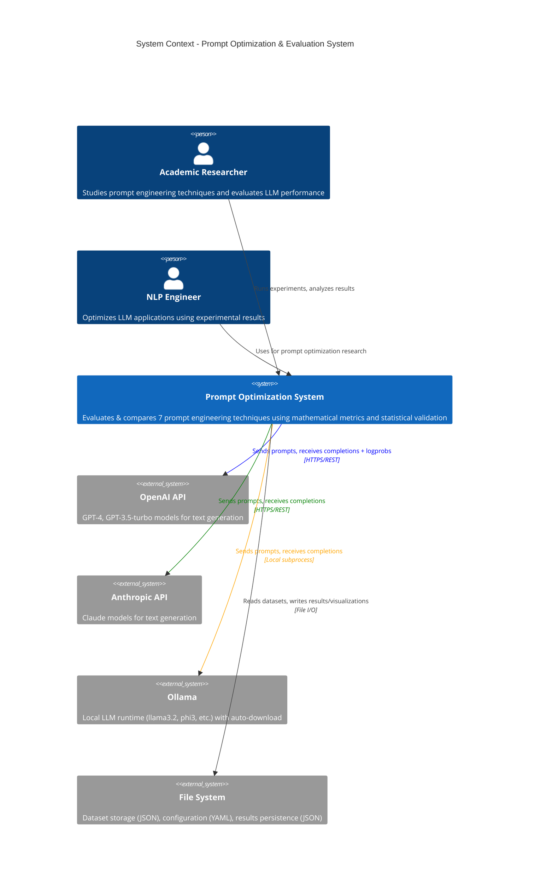

# C4 Context Diagram - Prompt Optimization System

**External Systems:**
- **OpenAI API**: Provides GPT-4 and GPT-3.5-turbo models with log probabilities for information-theoretic metrics
- **Anthropic API**: Provides Claude models (Opus, Sonnet, Haiku)
- **Ollama**: Local LLM runtime with automatic model downloading
- **File System**: Stores JSON datasets (140 samples), YAML configurations, JSON results, and PNG/SVG visualizations

**Users:**
- **Academic Researchers**: Primary users conducting prompt engineering research
- **NLP Engineers**: Secondary users optimizing production LLM applications
